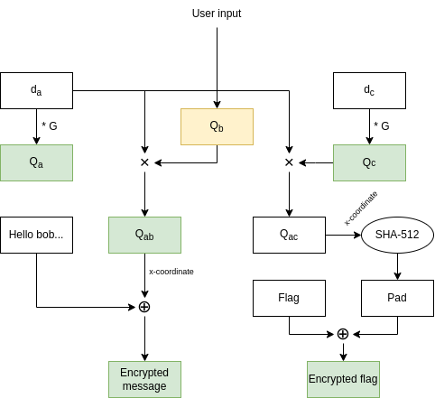

ABC
===

## Outline
This challenge was a cryptography challenge. A server with a port exposed and a Rust source code were provided.

The Rust source implements Elliptic Curve point addition and multiplication on P-192 curve. The P-192 parameters used are good, let's assume the implementation to be correct.

The server does the following :
- Compute a random $d_a$ value below P-192 curve order (Alice private key)
- Compute $Q_a = d_c * G$ with $G$ being P-192 curve Generator (Alice public key)
- Print $Q_a$
- Ask the user for Bob's public key, reading two integers $x$ and $y$ and creating point $Q_b = (x, y)$
- Compute $Q_{ab} = d_a * Q_b$ and print the message "Hello, Bob. What are you bringing to the potluck???" xored with the __raw__ x-coordinate of $Q_{ab}$
- Compute a random $d_c$ value below P-192 curve order (Charlie private key)
- Compute $Q_c = d_c * G$ (Charlie public key)
- Compute $Q_{ac} = d_a * Q_c$
- Print the flag xored with the __SHA-512 hash__ of the x-coordinate of $Q_{ac}$

The random generator used is based on `/dev/urandom` and seems okay.
The xoring performed on "Hello, Bob. [...]" message enables us to recover the x-coordinate of $Q_{ab}$.
In order to recover the flag, we have to find a way to compute $Q_{ac}$. The only thing we can control here is $Q_b$, which it is __not__ checked to be on the curve.



## Invalid Curve Attack
After searching a bit, there is a well-known attack for such cases, the Invalid Curve Attack.

Elliptic curve addition operation does not use the value of $b$ from curve equation $y² = x³ + a*x + b$. The multiplication $Q_{ab} = d_a * Q_b$ is therefore performed on the curve $Q_b$ is on. We can therefore select a value for $b$ for which the curve $y² = x³ + a*x + b$ will be easy perform an ECDLP on and pass a point from this curve to as $Q_b$.

The curve we are looking for must have an order that can be decomposed as much as possible.
This sagemath code performs this computation:

```python
from sage.all_cmdline import *


p = 0xfffffffffffffffffffffffffffffffeffffffffffffffff
a = 0xfffffffffffffffffffffffffffffffefffffffffffffffc

while True:
    b = randint(1, p)
    E = EllipticCurve(GF(p), [a, b])
    factors = list(prime_factors(E.order()))
    # We want the sum of the factors to be as low as possible
    print(str(sum(factors)).zfill(100), factors, b)
```

After letting it compute for some time (a few minutes), the best result was $$b = 3419924089188171531631734639358559054707392480589341110188$$ for which the order of the curve is $$n_2 = 2 * 7 * 67 * 433 * 503 * 68111 * 24488039 * 3684403033 * 3258629438539 * 15656727733883$$

In order to perform the ECDLP, we will perform it on each sub-curves associated with those cofactors and use Chinese Rest Theorem to recover the key.

Recovered $Q_{ab}$ be the opposite of the real one as we know only the x-coordinate and opposite points share their x-coordinate.
The value recovered by ECDLP will therefore be either $d_a \mod n_2$, or, if the sign is wrong, $n_2 - (d_a \mod n_2)$.

```python
from sage.all_cmdline import *

p = 0xfffffffffffffffffffffffffffffffeffffffffffffffff
a = 0xfffffffffffffffffffffffffffffffefffffffffffffffc
real_b = 0x64210519e59c80e70fa7e9ab72243049feb8deecc146b9b1
real_order = 0xffffffffffffffffffffffff99def836146bc9b1b4d22831
good_b = 3419924089188171531631734639358559054707392480589341110188
p192_Gx = 0x188da80eb03090f67cbf20eb43a18800f4ff0afd82ff1012
p192_Gy = 0x07192b95ffc8da78631011ed6b24cdd573f977a11e794811
message = b"Hello, Bob. What are you bringing to the potluck???"

dlogs = []
factors = []
E = EllipticCurve(GF(p), [a, good_b])
order = E.order()
factors = list(prime_factors(order))
G = E.gen(0)

print("Send this and provide ciphertext")
print(*G.xy(), sep=", ")

Q_x = int.from_bytes(bytes(x^^y for x, y in zip(bytes.fromhex(input()), message))[:24], "little")

# Compute Q_ab, maybe the sign is wrong
Q = E.lift_x(GF(p)(Q_x))

for i in range(len(factors)):
    print(i, factors[i])
    f = order // factors[i]
    Qp = Q * f
    Gp = G * f
    dlogs.append(Gp.discrete_log(Qp))

secret = CRT_list(dlogs, factors)

# Possible value for d_a % order
print(secret, order - secret)

print("Give alice x")
alice_x = int(input())
E = EllipticCurve(GF(p), [a, real_b])
G = E(p192_Gx, p192_Gy)

for d_a in range(secret, real_order, order):
    if (d_a * G).xy()[0] == alice_x:
        print("d_a =", d_a)

for d_a in range(order - secret, real_order, order):
    if (d_a * G).xy()[0] == alice_x:
        print("d_a =", d_a)
```

The final loops should only print a single private key.

Using it and Charlie's public key, we can compute the shared key, the hash of its x-coordinate and xor the ciphertext to recover the flag: `potluck{192_DisCr3te_L0g_I$_5upr1sing1y_triVi4l@!@!!}` 
